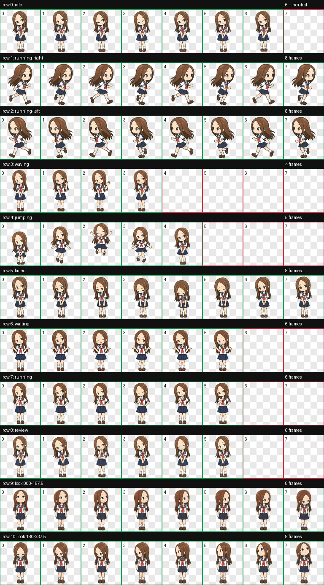
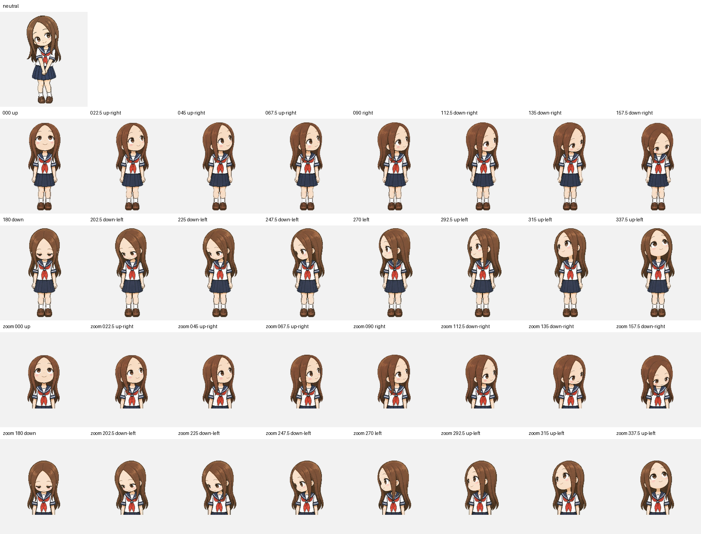

# 高木同学 · Codex 桌面宠物

一只以《擅长捉弄的高木同学》中的高木同学为原型制作的**非官方同人宠物**。角色图像使用 AI 辅助生成，供喜欢这个角色的用户在 Codex 桌面应用中展示。



## 效果

宠物包含 9 类动作：待机、向右移动、向左移动、挥手、跳跃、受挫、等待输入、工作中和查看结果；另有 16 个视线方向。完整图集采用 Codex v2 格式，尺寸为 1536 × 2288 像素。




视线帧已经制作完整。当前客户端会根据可用的光标位置选择方向；在常见的聊天输入场景里，光标通常位于宠物下方，因此向下看的姿势更容易出现，其他方向未必经常触发。

## 安装

下载此仓库，找到 `pet.json` 和 `spritesheet.webp`。将这两个文件一起放入 Codex 的自定义宠物目录：

```text
<Codex 配置目录>/pets/takagi-pixel/
├── pet.json
└── spritesheet.webp
```

通常配置目录为 Windows 的 `%USERPROFILE%\.codex`，或 macOS / Linux 的 `~/.codex`。然后在桌面应用的 **设置 → 宠物** 中刷新列表并选择“高木同学”。桌面应用的操作步骤可参阅 [OpenAI 宠物文档](https://developers.openai.com/zh-Hans/docs/pets)。

如果启用了系统的“减少动态效果”，客户端可能只显示静态帧。网页版对自定义精灵图的格式和尺寸要求不同，本仓库的 11 行 v2 图集面向桌面应用。

## 文件

| 文件 | 用途 |
| --- | --- |
| `pet.json` | 宠物名称和 v2 图集配置 |
| `spritesheet.webp` | 透明动画图集，实际安装只需它和 `pet.json` |
| `动作总览.png` | 9 类动作与视线的预览 |
| `视线方向.png` | 16 个方向的预览 |
| `挥手预览.gif` | 挥手动画预览 |

## 作品与权利说明

这是非官方同人作品，与原作作者、出版方、动画制作方及 OpenAI 没有隶属、合作或背书关系。高木同学及相关作品的权利归各自权利人所有。AI 辅助生成和非商业说明不代表已获得权利方许可。

本仓库公开文件供查看和安装，**未授予原作角色或图像的商用、改编、再分发许可**。因此没有给整个仓库套用 MIT、CC0 等开源许可证。如果你需要在自己的项目中发布或商用这些图像，请自行确认所需授权。
